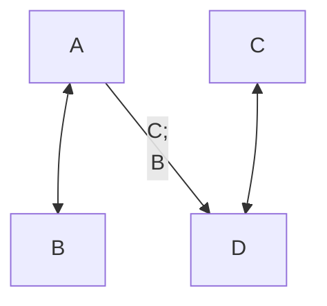

# Питагорина теорема

- [Фотографије табле](https://photos.app.goo.gl/VDR4tSNqEeCmY8nh6)
- [Каталог линкова](https://ndjapic.github.io/zayopa/m7/02-pitagora/)

- [Вавилонска плоча Плимптон 322](https://personal.math.ubc.ca/~cass/courses/m446-03/pl322/pl322.html)
- [Pythagorean Theorem II (visual proof)](https://www.youtube.com/watch?v=yfGtbNgcrQ8)
- [How many ways are there to prove the Pythagorean theorem?](https://www.youtube.com/watch?v=YompsDlEdtc)
- [Visual Proof of Pythagoras' Theorem](https://www.youtube.com/watch?v=tTHhBE5lYTg)

```mermaid
graph TD;
    PT[node_string '$c^2=a^2+b^2$'] <-- C{node_string '$c$'};
    PT[node_string '$c^2=a^2+b^2$'] <-- A{node_string '$a$'};
    PT[node_string '$c^2=a^2+b^2$'] <-- B{node_string '$b$'};
```


