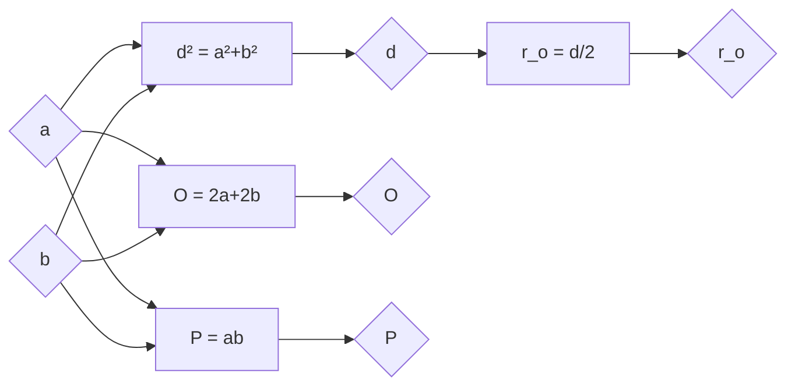

# Правоугаоник

- Углови су једнаки, дијагонале су једнаке.
- Правоугаоник је тетиван. Дијагонала је пречник описане кружнице.
- Симетрале страница су осе симетрије правоугаоника. Правоугаоник који није квадрат има две осе симетрије.

