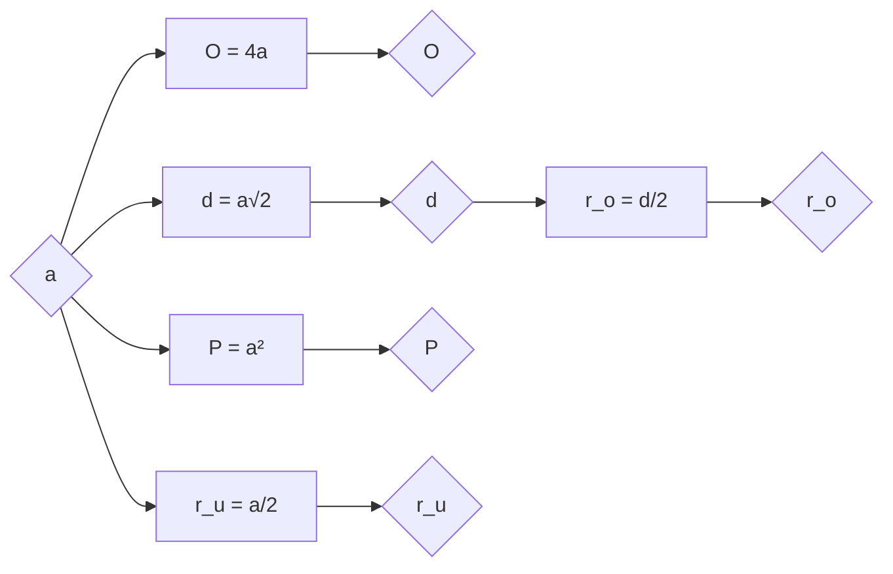

# Квадрат

- Странице су једнаке, углови су једнаки.
- Сваки квадрат је правоугаоник и ромб. Особине и формуле за правоугаоник и ромб важе и за квадрат.
- Симетрале страница и симетрале углова квадрата су осе симетрије квадрата. Квадрат има укупно четири осе симетрије.

