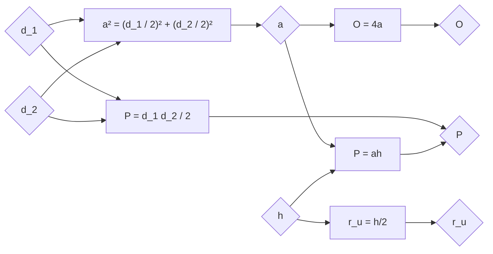

# Ромб

- Странице су једнаке, дијагонале су нормалне.
- Ромб је тангентан. Висина је пречник уписане кружнице.
- Симетрале углова садрже дијагонале и оне су осе симетрије ромба. Ромб који није квадрат има две осе симетрије.
- Сваки ромб је паралелограм и делтоид. Особине и формуле за паралелограм и делтоид важе и за ромб.

