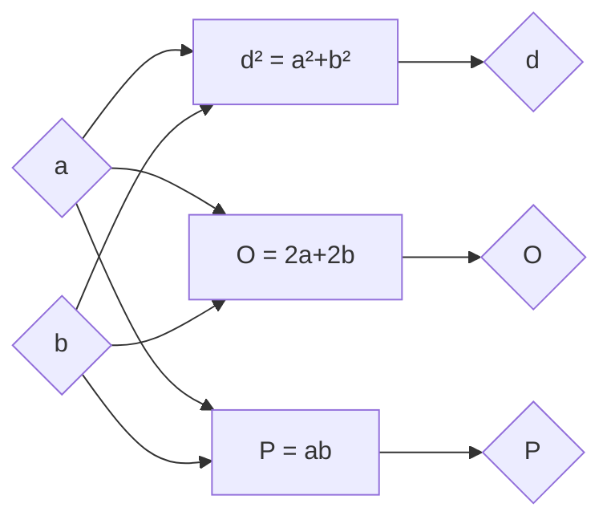

# Правоугаоник

- Дијагонале су једнаке.
- Правоугаоник је тетиван. Дијагонала је пречник описане кружнице.
- Симетрале страница су осе симетрије правоугаоника. Правоугаоник има две осе симетрије.

