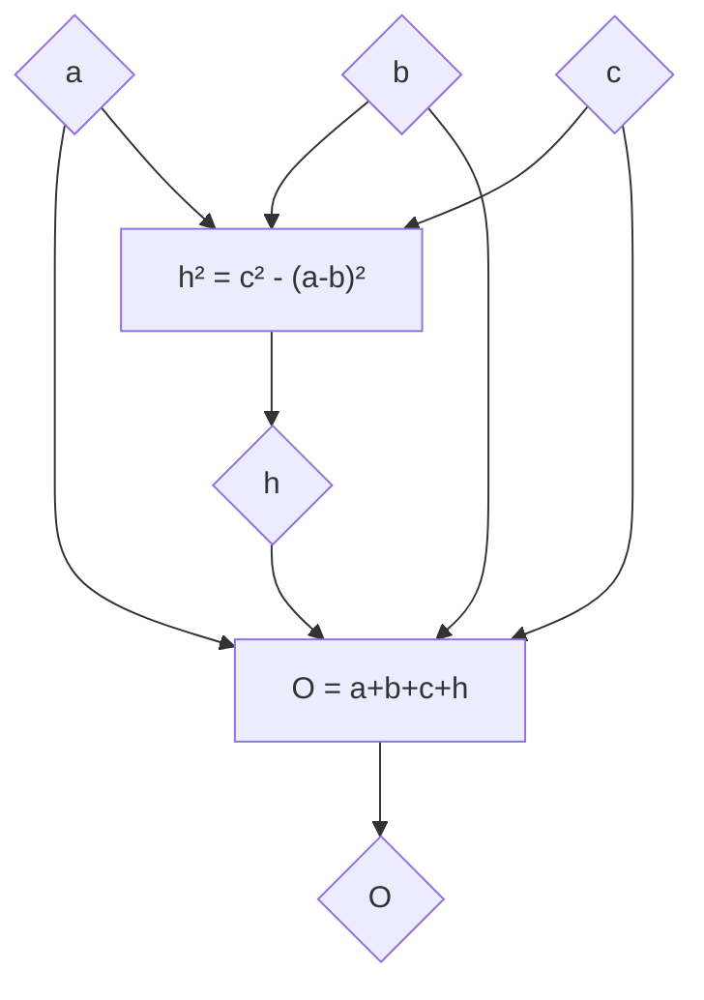

# Правоугли трапез

- Трапез који има прав угао називамо правоугли трапез. Други угао на истој основици је такође прав.
- Висина је једнака краћем краку.

```mermaid
graph TD;
    PT["h² = c² - (a-b)²"] --> H
    FO[O = a+b+c+h] --> O{O};
    A{a} --> FO;
    A --> PT;
    B --> PT;
    C --> PT;
    B{b} --> FO;
    C{c} --> FO;
    H{h} --> FO;
```
