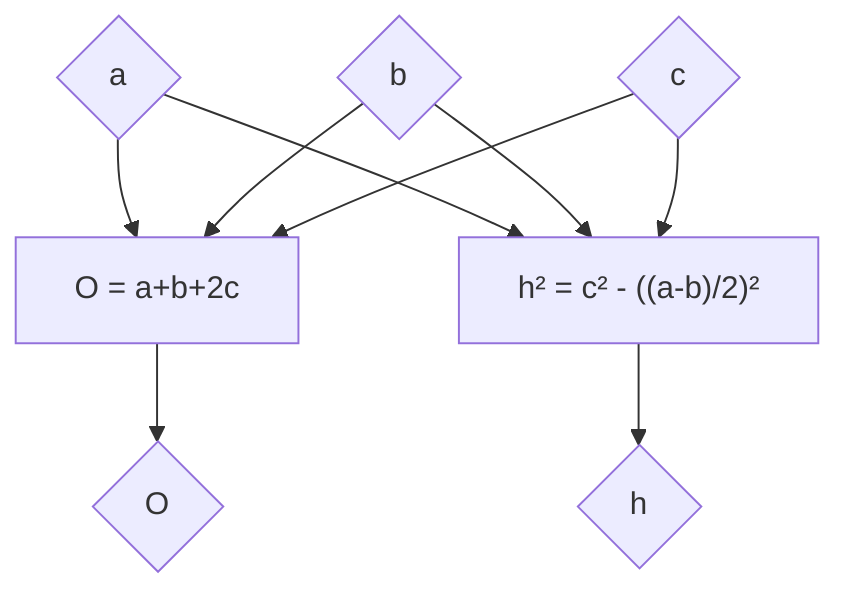

# Једнакокраки трапез

- Трапез који има једнаке краке називамо једнакокраки трапез.
- Углови на основици су једнаки.
- Оса симетрије је симетрала основица.
- Једнакокраки трапез је тетиван.

```mermaid
graph TD;
    PT["h² = c² - ((a-b)/2)²"] --> H{h}
    FO[O = a+b+2c] --> O{O};
    A{a} --> FO;
    A --> PT;
    B{b} --> PT;
    B --> FO;
    C{c} --> PT;
    C --> FO;
```
