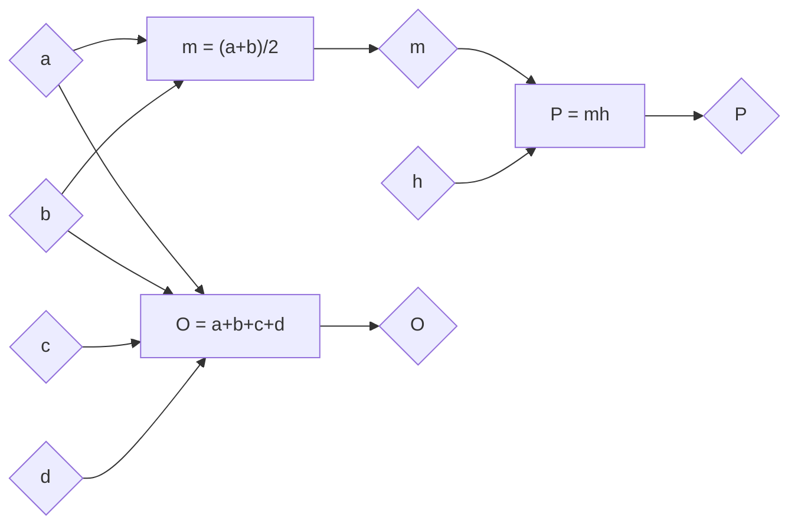

# Трапез

- Трапез је четвороугао који има један пар паралелних страница.
- Паралелне странице називамо основице, а преостале две краци.
- Углови на истој основици су суплементни.
- Средња линија је дуж која спаја средишта кракова. Паралелна је са основицама.

