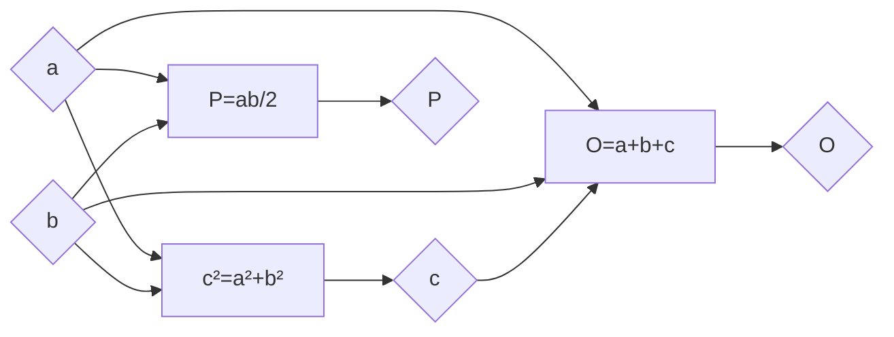

# Правоугли троугао

- Најдужа страница се зове хипотенуза, а преостале две странице су катете.
- Оштри углови правоуглог троугла су комплементни.
- Пречник описане кружнице је хипотенуза, а њено средиште је центар.

