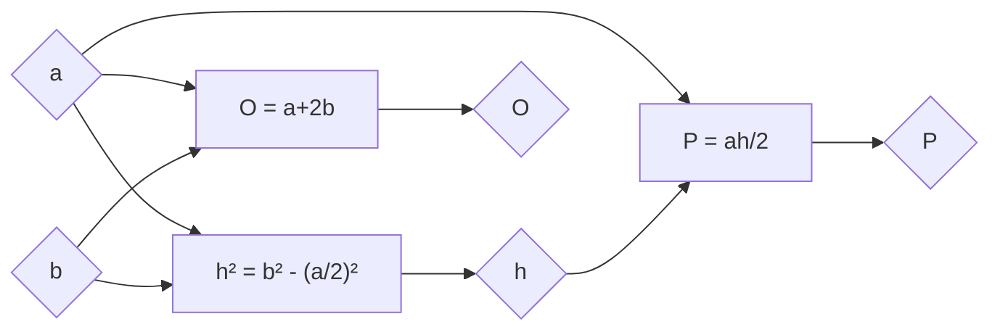

# Једнакокраки троугао

- Две једнаке странице називамо краци, а трећу страницу основица.
- Углови на основици су једнаки.
- Теме наспрам основице називамо врх.
- Симетрала основице је оса симетрије троугла. На њој су све четири значајне тачке троугла.

