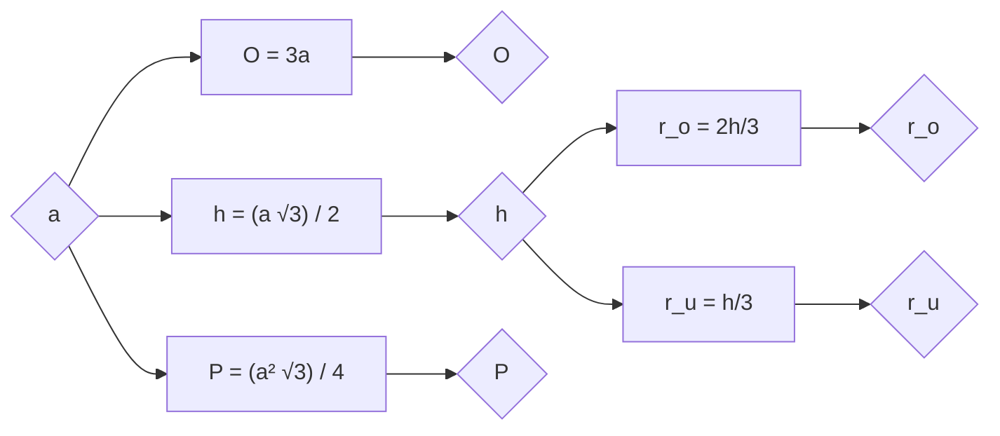

# Једнакостранични троугао

- Странице су једнаке, углови су једнаки.
- Сваки угао има 60 степени. Једнакостранични троугао је оштроугли.
- Четири значајне тачке троугла се поклапају. Центар троугла дели висину у односу 2:1.
- Формуле за једнакокраки троугао важе и за једнакостранични.

